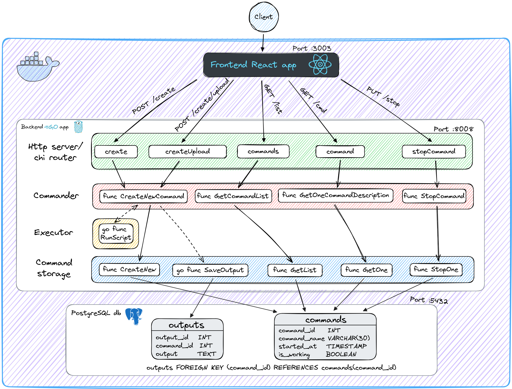

# Script Executor

It's a full-stack web application called Script Executor that lets people execute bash scripts on remote server.
Backend powered by Go. Frontend powered by React.

## Scheme



## Features

- 3 levels of logging (edit in ./back/configs/local.yaml)
- Web api server use chi router
- RESTful routing
- Data base - PostgreSQL
- Frontend using React

## Development

Software requirements:

- Git
- Docker

To start the application use three commands:

```sh
$ git clone https://github.com/enchik0reo/script-executor

$ cd script-executor

$ docker-compose up --build
```
- Go to http://localhost:3003/ and try app

To terminate service, the application uses `SIGTERM` signal (use Ctrl+C)